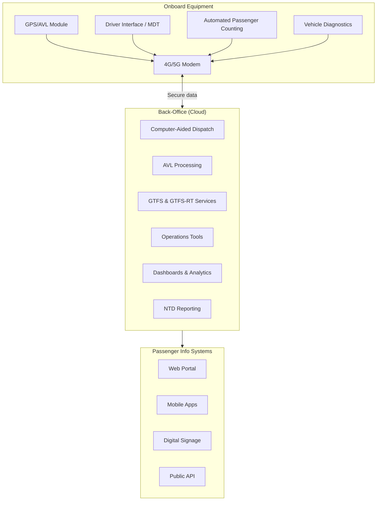

# Comprehensive CAD/AVL/GPS Transit Software

## Overview
This document describes the high-level design for a cloud-based Computer-Aided Dispatch (CAD) and Automatic Vehicle Location (AVL) system with passenger information services (PIS). It covers the main components, their responsibilities, data flows, and an implementation roadmap.

## System Architecture

The system is divided into three major parts:

1. **Onboard Equipment** – hardware installed in each vehicle for location tracking, driver interface, diagnostics, and communications.
2. **Back-Office Cloud** – the central management platform that handles dispatch, AVL data processing, GTFS feed management, analytics, and administration.
3. **Passenger Information Systems** – public-facing web/mobile applications, APIs, and signage that provide real-time information to riders.

## Main Components and Responsibilities

### Onboard Equipment
- **GPS/AVL Module** – Provides real-time location, speed, and heading. Supports configurable update frequency and stores data offline if connectivity is lost.
- **Communication Module** – 4G/5G modem enabling secure two-way data exchange with the cloud (HTTPS or MQTT over TLS).
- **Driver Interface / MDT (optional)** – Logins, route/run selection, two-way messaging, navigation, emergency alerts.
- **Automated Passenger Counting (optional)** – Collects board/alight data per stop for analytics and reporting.
- **Vehicle Diagnostics (optional)** – Reads OBD-II/J1939 data such as engine status and fault codes.
- **Power Management** – Protects vehicle battery and supports remote updates to onboard firmware.

### Back-Office Software (Cloud)
- **Computer-Aided Dispatch** – Real-time map display, route and schedule management, detour management, headway tools, and message center.
- **AVL Processing** – Ingests location reports, validates them, monitors adherence, triggers alerts, and stores history.
- **GTFS & GTFS-RT Services** – Build and manage static GTFS data and generate GTFS-Realtime feeds for downstream systems.
- **Operations Tools** – Messaging with drivers, disruption management, and remote configuration of onboard equipment.
- **Dashboards & Analytics** – KPI monitoring, historical data analysis, and customizable reports.
- **NTD Reporting** – Aggregates metrics (e.g., revenue hours, miles, passenger counts) and prepares export formats for the National Transit Database.
- **Incident Management** – Tracks accidents, breakdowns, and other operational incidents.
- **User Management & Security** – Role-based access control, auditing, and system configuration.

### Passenger Information Systems
- **Web Portal** – Public website with real-time map, stop times, route schedules, and service alerts.
- **Mobile Apps** – Native apps mirroring web functionality, with push notifications for selected routes/stops.
- **Digital Signage** – Feeds arrival predictions to on-street displays at bus stops or stations.
- **Public API** – RESTful endpoints for third-party developers to access GTFS-RT and other open data sets.

## Key User Stories

### Dispatcher
1. **View Live Map**
   - As a dispatcher, I can view the location and status of all vehicles in real time on an interactive map so I can monitor service delivery.
2. **Communicate with Drivers**
   - As a dispatcher, I can send and receive messages or canned responses to drivers so that operational instructions are clearly conveyed.
3. **Manage Detours**
   - As a dispatcher, I can create detours and service advisories to keep riders informed during disruptions.

### Driver
1. **Log In and Select Run**
   - As a driver, I log into the MDT and select my assigned run so the system can begin reporting my adherence.
2. **Receive Messages**
   - As a driver, I receive instructions from dispatch in a safe and hands-free manner.
3. **Report Emergency**
   - As a driver, I can trigger a panic alert to inform dispatch of emergencies.

### Operations Manager
1. **Analyze On-Time Performance**
   - As an operations manager, I can generate OTP reports for a given time period, route, or block to identify problem areas.
2. **Generate NTD Reports**
   - As an operations manager, I can automatically gather data for NTD reporting to reduce manual effort and errors.

### Rider
1. **Check Real-Time Arrivals**
   - As a rider, I can see my bus on a map and know how many minutes away it is from my stop.
2. **Receive Service Alerts**
   - As a rider, I receive notifications when my route is experiencing a detour or delay.

## Technology Stack Recommendations
- **Cloud Platform**: AWS, Azure, or Google Cloud Platform. Use managed services for computing (Kubernetes or serverless), database, and messaging.
- **Databases**: PostgreSQL with PostGIS for geospatial data; time-series database such as TimescaleDB or InfluxDB for AVL data.
- **Message Broker**: MQTT or AMQP-based broker (e.g., RabbitMQ, AWS IoT Core) for reliable inbound AVL messages.
- **Backend Services**: Implement microservices in languages such as Node.js (TypeScript) or Python with frameworks like FastAPI or NestJS.
- **Frontend**: React or Angular for web dashboards. React Native or Flutter for cross-platform mobile apps.
- **APIs**: REST/GraphQL using HTTPS with OAuth2 / JWT for secure access.
- **CI/CD**: Use GitHub Actions or GitLab CI for automated testing and deployments.
- **Infrastructure as Code**: Terraform or CloudFormation to manage cloud resources.

## Implementation Roadmap
The project can be broken into phases for manageable delivery.

### Phase 1: Foundation
- Establish cloud infrastructure (CI/CD, databases, networking).
- Implement core AVL data ingestion service and basic vehicle monitoring dashboard.
- Develop initial onboard software for GPS reporting and communications.
- Provide simple web portal for riders with live bus map.

### Phase 2: Dispatch and Operations Tools
- Build full CAD module with route and schedule management, detour handling, and messaging.
- Integrate driver MDT features (login, run selection, two-way messaging).
- Implement GTFS builder/editor and start publishing GTFS-RT feeds.

### Phase 3: Analytics and Reporting
- Add dashboards for KPIs, historical data queries, and trend reporting.
- Integrate APC data if available.
- Provide automated NTD reporting capabilities.

### Phase 4: Passenger Experience Enhancements
- Develop mobile apps with personalized alerts.
- Integrate digital signage and IVR systems where needed.
- Expose public APIs for third-party developers.

### Phase 5: Optimization & Expansion
- Introduce advanced features such as headway management, predictive maintenance via diagnostics, and machine-learning-based arrival predictions.
- Scale the system to additional agencies or larger fleets.

## Risk Assessment and Mitigation
| Risk | Mitigation |
|------|------------|
| **Connectivity Issues** – Cellular network outages or weak coverage may disrupt real-time data. | Implement offline buffering in the onboard unit and retry logic. Provide multi-carrier SIM options. |
| **Data Security Breaches** – Unauthorized access to transit data or passenger information. | Use end-to-end encryption, strong authentication, regular security audits, and adhere to privacy regulations. |
| **Scalability Constraints** – Sudden growth may strain infrastructure. | Deploy on cloud platforms with auto-scaling capabilities and monitor resource usage closely. |
| **Hardware Failure** – Onboard equipment may fail due to harsh conditions. | Choose rugged hardware with vehicle-specific power management; keep spare units and remote diagnostics. |
| **User Adoption Challenges** – Staff or riders may struggle to use new tools. | Provide thorough training, intuitive interfaces, and clear documentation. |
| **Integration with Legacy Systems** – Existing agency systems may require custom interfaces. | Design modular APIs and plan for data interchange formats; allocate time for integration testing. |

## Non-Functional Considerations
- **Scalability** – Use container orchestration (e.g., Kubernetes) or serverless architectures to allow horizontal scaling of processing services and databases.
- **Reliability & Availability** – Deploy services in multiple availability zones, use managed databases with replication, and apply health checks with automatic restarts.
- **Performance** – Tune message broker and databases to handle high volume AVL data; target <5s latency from vehicle report to map display.
- **Security** – Encrypt data at rest and in transit, enforce RBAC, regularly patch software, and maintain audit logs.
- **Usability** – Provide clean web and mobile interfaces, support keyboard navigation and accessibility best practices.
- **Maintainability** – Adopt microservice architecture with clear boundaries, use automated testing and logging for easier debugging.
- **Interoperability** – Adhere strictly to GTFS and GTFS-RT specs; provide well-documented REST APIs.
- **Data Management** – Configure retention policies, allow export in CSV/JSON formats, ensure agency ownership of data.
- **Deployment** – Use Infrastructure as Code; enable rolling updates with minimal downtime.
- **Support and Updates** – Offer SLAs for technical support, plan regular release cycles for improvements and security patches.

